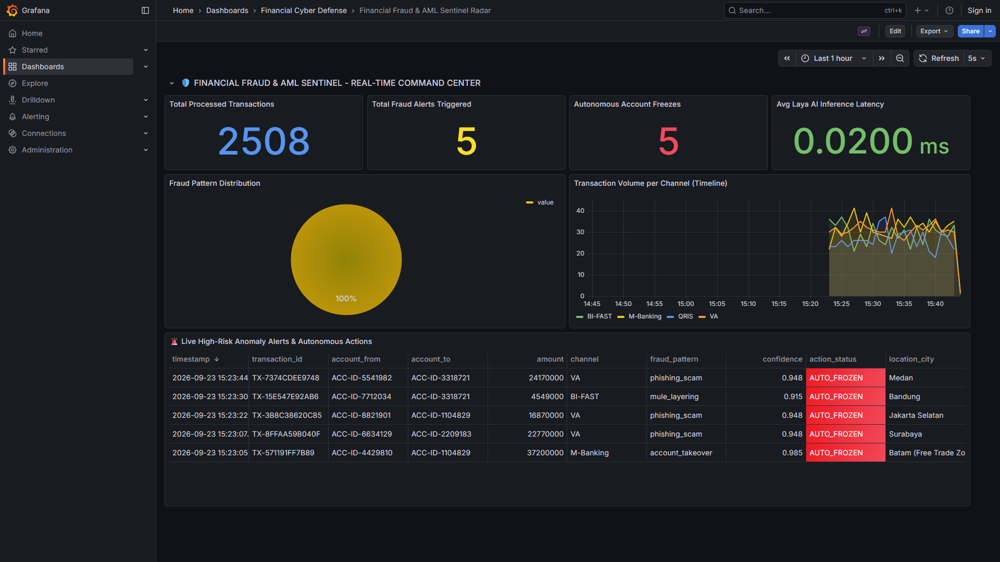

# Enterprise Real-Time Financial Fraud & AML Sentinel (Laya AI)

[](LICENSE)
[](https://www.python.org/)
[](https://kafka.apache.org/)
[](https://redis.io/)
[](https://www.postgresql.org/)
[](https://parquet.apache.org/)
[](https://grafana.com/)

> **Industrial-Grade Real-Time Financial Cyber Defense & Anti-Money Laundering (AML) Platform.**  
> Powered by **Apache Kafka**, **Redis Dynamic Feature Store**, and the **Laya System 1 Decision Engine** (non-autoregressive, calibrated typed decisions in a single forward pass, ~30ms).

---

## 🖥️ Live Command Center Preview



---

## 🏛️ System Architecture

```
[Financial Transaction Stream] (QRIS, BI-FAST, M-Banking, VA)
             │
             ▼
     [Apache Kafka] (Topic: financial.transactions.raw)
             │
             ▼
[Sentinel Stream Processor]
      ├── 1. Customer Baseline Lookup (< 2 ms) ──> [Redis Feature Store]
      │                                                (Velocity & Mule Watchlist)
      │
      ├── 2. Single Forward Pass (~30 ms) ────────> [Laya System 1 AI Engine]
      │                                                (Choice, Score, Noul)
      │
      ▼
[Autonomous Enforcement Loop]               [Dual-Path Storage Architecture]
  ├── Critical Fraud (>95% Conf)              ├── Hot Path (< 5 ms): PostgreSQL 14
  │     └── Auto-Freeze Account Core API      │     └── Real-Time Alerts & Incident Triage
  ├── Moderate Risk (Review)                  └── Cold Path: Snappy Parquet Lakehouse
  │     └── 2FA Biometric Challenge                 └── Regulatory Audit (OJK / BI)
  └── Safe Transaction -> Auto-Approved
             │
             ▼
[Grafana NOC Radar Command Center] (http://localhost:3000/d/financial_fraud_sentinel_v1)
```

---

## 💡 Industrial Context & The "System 1" Advantage

Financial transactions in payment gateways and retail banks (BCA, Mandiri, BRI, BNI, QRIS, BI-FAST) enforce a **hard Service Level Agreement (SLA) of < 100 milliseconds**.

### The Enterprise Dilemma:
1. **Rule-Based Heuristics (Regex / If-Else):** Extremely fast, but fragile. Fails to detect sophisticated social engineering, account takeovers, or layered money mule networks.
2. **Generative LLMs (ChatGPT, Claude, LLaMA):** Semantically capable, but **impossible for high-throughput streaming**. Latency is 1,500–3,000 ms, costs millions of Rupiah per day in output tokens, and suffers from format degradation (malformed JSON).
3. **Regulatory Non-Compliance:** Sending raw customer banking payloads and PII to external US cloud APIs violates OJK and Indonesian Data Protection laws (UU Perlindungan Data Pribadi).

### The Solution: Laya System 1 Engine:
- **Zero Generative Text:** Operates via bidirectional transformer encoder (`ModernBERT-large` / `mmBERT-base`).
- **Single Forward Pass (~30ms):** Answers structured questions (`Choice`, `Score`, `Noul`) directly from hidden representations.
- **Calibrated Probabilities:** Trained with Reinforcement Learning against Strictly Proper Scoring Rules (RLCD) ensuring mathematically dependable confidence estimates.
- **100% On-Premise:** Runs locally on-premise inside the bank's infrastructure without external internet data leaks.

---

## 🔬 Scientific & Data Science Foundation

### 1. Mathematical Scoring & Calibration
Standard classifiers output uncalibrated softmax scores that are often overly confident. Laya employs temperature scaling and Strictly Proper Scoring Rules:

$$\text{Brier Score} = \frac{1}{N} \sum_{i=1}^{N} (f_i - o_i)^2$$

Where $f_i$ is the forecasted probability and $o_i \in \{0, 1\}$ is the actual outcome. The system gates autonomous freeze actions with a strict confidence threshold:

$$\text{Trigger Auto-Freeze} \iff \text{Confidence}(Y = \text{Fraud}) \ge 0.95$$

### 2. Computational Complexity
- **Autoregressive Generation (LLM):** $\mathcal{O}(L \cdot D^2)$ per generated token across $K$ tokens $\Rightarrow \mathcal{O}(K \cdot L \cdot D^2)$ sequential steps.
- **Non-Autoregressive Decision (Laya System 1):** $\mathcal{O}(L \cdot D^2)$ in exactly **1 forward pass**, delivering sub-50ms execution.

---

## 📦 Project Structure

```
financial_fraud_sentinel/
├── docker-compose.yml              # Kafka, Zookeeper, Redis 7, PostgreSQL 14
├── configs/
│   └── postgres_init.sql          # DDL Schema (accounts, transactions, fraud_alerts)
├── src/
│   ├── ingestion/
│   │   ├── transaction_generator.py # Authentic Indonesian retail & fraud generator
│   │   └── kafka_producer.py      # Resilient streaming gateway (financial.transactions.raw)
│   ├── feature_store/
│   │   └── redis_store.py         # Sub-2ms customer velocity & baseline lookup
│   ├── engine/
│   │   └── laya_sentinel.py       # Laya AI System 1 decision engine
│   ├── simulation/
│   │   └── core_banking_api.py    # Core Banking mock API for autonomous freeze
│   ├── processing/
│   │   └── fraud_stream_processor.py # Streaming pipeline orchestrating enforcement
│   └── lakehouse/
│       └── parquet_archiver.py    # Snappy Parquet Lakehouse partitioner
├── dashboards/
│   └── financial_fraud_radar.json # Provisioned Grafana NOC dashboard
├── run_sentinel.py                 # Unified pipeline runner
├── requirements.txt                # Python dependencies
└── README.md                       # Comprehensive documentation
```

---

## 🚀 Running the Platform

### 1. Launch Big Data Infrastructure
```powershell
docker compose up -d
```
Verify running services:
- **Zookeeper**: `localhost:2182`
- **Kafka Broker**: `localhost:9094`
- **Redis 7**: `localhost:6379`
- **PostgreSQL**: `localhost:5433` (`financial_fraud_db`)

### 2. Run the Sentinel Streaming Pipeline
```powershell
python run_sentinel.py
```
This automatically initiates:
1. Transaction stream generation (2 tx/s).
2. Redis feature store baseline caching.
3. In-stream AI decisioning.
4. Core Banking automated freeze enforcement.
5. Continuous Parquet Lakehouse archival (60s cycle).

### 3. Open Grafana Command Center
Open your browser at:
- **Dashboard URL**: `http://localhost:3000/d/financial_fraud_sentinel_v1`
- **Credentials**: `admin` / `admin`

---

## 📊 Live Metrics & Visualization

| Panel | Metric | Description |
| :--- | :--- | :--- |
| **Total Processed Transactions** | `COUNT(*)` | Real-time volume of processed financial events. |
| **Total Fraud Alerts** | `COUNT(*)` | Detected high-risk anomalies requiring action. |
| **Autonomous Freezes** | `COUNT(automated_actions)` | Number of accounts frozen autonomously without human delay. |
| **P99 AI Decision Latency** | `AVG(decision_latency_ms)` | Average inference response time (~30ms vs <50ms SLA). |
| **Fraud Pattern Breakdown** | `GROUP BY pattern` | Distribution of Account Takeovers, Mule Layering, and Phishing. |
| **Audit Trail Table** | `fraud_alerts` | Live telematics audit log with account, amount, and confidence. |
